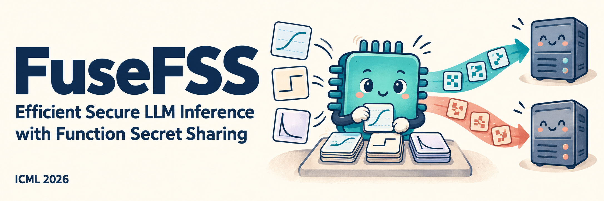

<p align="center">
  
</p>

<p align="center">
  <a href="https://openreview.net/forum?id=WpUpj8DrVB"></a>
  <a href="#quick-start"></a>
  <a href="docs/GETTING_STARTED.md#gpu-build"></a>
  <a href="LICENSE"></a>
</p>

<p align="center">
  <a href="https://openreview.net/forum?id=WpUpj8DrVB"><b>Paper</b></a> ·
  <a href="https://openreview.net/pdf?id=WpUpj8DrVB">PDF</a> ·
  <a href="#quick-start">Quick start</a> ·
  <a href="#how-it-works">How it works</a> ·
  <a href="docs/README.md">Documentation</a> ·
  <a href="#citation">Citation</a>
</p>

**Compile nonlinear operators into efficient secure computation.** FuseFSS replaces bespoke FSS protocols for scalar fixed-point operators with a common specification and compilation pipeline. It integrates with Sigma GPU-MPC to accelerate two-server LLM inference while keeping client inputs private in the semi-honest, non-colluding-server setting.

Code for **[FuseFSS: Efficient Secure LLM Inference with Function Secret Sharing](https://openreview.net/forum?id=WpUpj8DrVB)**, by **Yuhan Ma, Yong Li, and Stefan Schmid**, accepted at **ICML 2026**.

## Why FuseFSS?

- **Add operators through a common specification.** Describe an operator's intervals, arithmetic pieces, and helper predicates, then reuse the compilation pipeline. The integration covers GELU, SiLU, and the scalar helpers inside softmax and normalization.
- **Reuse the cryptographic building blocks.** Compatible scalar gates compile to a packed comparison and a vector interval lookup, followed by share-based post-processing. Masking and predicate rewrites are handled by the compiler.
- **Explore the full path from specification to GPU execution.** The repository includes the compiler, CUDA runtime, Sigma integration, reference tests, and paired evaluation scripts.

## Quick start

### Explore the compiler without a GPU

**CMake 3.24+ and a C++17 compiler.** Run the reference evaluator and operator-frontend tests on a CPU:

```bash
git clone https://github.com/ponyyuhan/FuseFSS.git
cd FuseFSS

cmake -S . -B build_cpu \
  -DFUSEFSS_ENABLE_CUDA=OFF \
  -DCMAKE_BUILD_TYPE=Debug
cmake --build build_cpu -j 4
ctest --test-dir build_cpu --output-on-failure
```

Expected: `test_fusefss_ref_eval` and `test_operator_frontend` both pass. These check reference semantics and compilation; GPU inference is a separate path below. Debug mode keeps the frontend test's assertions enabled. To see how an operator is specified, start with [the frontend examples](src/tests/test_operator_frontend.cpp) and [the paper-to-code map](docs/IMPLEMENTATION_MAP.md).

### Run secure inference on GPUs

The GPU path integrates FuseFSS with Sigma and includes a runner that launches both parties, compares the two implementations, and collects logs and measurements.

**Linux x86-64 · NVIDIA CUDA · Python 3 · two GPUs recommended.** Follow the [GPU setup and first paired run](docs/GETTING_STARTED.md#gpu-build), then the [reproduction guide](docs/REPRODUCIBILITY.md) for the full experiment suite. A single-GPU sanity mode is also available.

## How it works

1. **Specify the scalar operator.** Define its intervals, per-interval polynomials, helper predicates, and a fixed post-processing circuit.
2. **Compile under masking.** Rewrite predicates and interval payloads for the public masked input `x_hat = x + r_in mod 2^n`. Public instance shapes are independent of the sampled masks.
3. **Evaluate on shares.** Packed comparison provides predicate shares; vector interval lookup provides coefficient and constant shares. Standard share-based post-processing produces the outputs.

The Sigma integration uses these scalar gates for **GELU, SiLU, nExp, reciprocal, and reciprocal square root**. Matrix multiplication, attention, and reductions remain in Sigma. The [implementation map](docs/IMPLEMENTATION_MAP.md) distinguishes the optimized benchmark path from the generic semantic checks and links the paper's abstractions to code. The banner is a conceptual illustration.

## Explore the project

| You want to… | Start here |
|---|---|
| Understand the method | [ICML 2026 paper](https://openreview.net/forum?id=WpUpj8DrVB) |
| Build and run a first example | [Getting started](docs/GETTING_STARTED.md) |
| Define a scalar operator | [Frontend examples](src/tests/test_operator_frontend.cpp) · [Operator specification](include/suf/operator_spec.hpp) |
| Connect the paper to the implementation | [Implementation map](docs/IMPLEMENTATION_MAP.md) |
| Reproduce BERT, GPT, and LLaMA experiments | [Evaluation guide](docs/REPRODUCIBILITY.md#end-to-end-evaluation) |
| Explore numerical accuracy and batch scaling | [Accuracy emulation](docs/REPRODUCIBILITY.md#accuracy-emulation) · [Batch scaling](docs/REPRODUCIBILITY.md#batch-scaling) |

## Repository guide

| Path | Contents |
|---|---|
| [`include/suf/`](include/suf/) | Operator specifications, intermediate representation, and post-processing interfaces |
| [`src/`](src/) | Compiler, CUDA runtime, and Sigma bridge |
| [`src/tests/`](src/tests/) | Reference, compiler, and GPU tests |
| [`third_party/EzPC_vendor/`](third_party/EzPC_vendor/) | Sigma GPU-MPC with FuseFSS integration |
| [`ezpc_upstream/`](ezpc_upstream/) | Sigma baseline for paired comparisons |
| [`scripts/`](scripts/) · [`bench/`](bench/) | Build scripts, evaluation runners, and accuracy experiments |
| [`docs/`](docs/README.md) | Setup, reproduction, and security model |

Internal names such as `suf` and `SUFDescriptor` predate the paper title; they refer to FuseFSS. See [compatibility names](docs/IMPLEMENTATION_MAP.md#compatibility-names).

## Security and scope

The artifact implements **input-private inference with public model weights**, assuming two semi-honest, non-colluding servers and preprocessing. Public shapes and operator specifications are visible. It is an academic implementation, not a production private-model serving system. Read the [security model](docs/SECURITY_MODEL.md) and [release scope](docs/RELEASE_SCOPE.md) for assumptions and boundaries.

## Citation

If you build on FuseFSS, please cite:

```bibtex
@inproceedings{ma2026fusefss,
  title     = {FuseFSS: Efficient Secure LLM Inference with Function Secret Sharing},
  author    = {Ma, Yuhan and Li, Yong and Schmid, Stefan},
  booktitle = {Proceedings of the 43rd International Conference on Machine Learning},
  year      = {2026},
  url       = {https://openreview.net/forum?id=WpUpj8DrVB}
}
```

Machine-readable metadata is available in [CITATION.cff](CITATION.cff).

## Contributing and license

Questions, bug reports, and focused contributions are welcome via [GitHub Issues](https://github.com/ponyyuhan/FuseFSS/issues). See [CONTRIBUTING.md](CONTRIBUTING.md) for development and testing instructions.

FuseFSS project code is released under the [Apache License 2.0](LICENSE). Third-party components under `third_party/` and `ezpc_upstream/` retain their original licenses.
